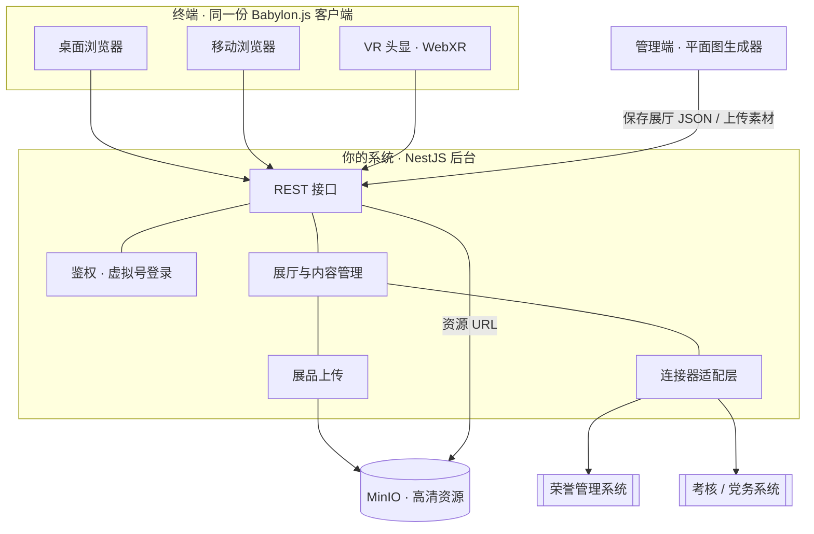

# 企业虚拟展厅系统 · 项目计划书

> 版本 v1.0 · 单人浏览型 · Web(Babylon.js)· 内网自托管 · 支持 VR · 数据驱动 / 组件化
> 后台沿用现有 NestJS 系统;本文档可直接并入系统设计文档使用。
>
> **纳入计划:2026-06-07** —— 从用户规划书导入为本仓库权威 spec。衔接已建 `model3d` 模块(火山 Seed3D→`.glb`)+ 3D 展厅交接任务 `~/.claude/plans/ai-3d-indexed-wren.md`。连接器:荣誉墙→证书/荣誉、党务公开板→任务/党务;素材走 `storage`(自托管 MinIO,storage 抽象已留 S3 占位)。独立 Babylon.js 客户端,**不并入现有 React 后台工程**(另起前端,复用 NestJS 后台 + storage)。

---

## 目录
1. 项目概述
2. 范围与目标(含明确不做的部分)
3. 总体架构
4. 技术栈
5. 数据模型与接口契约 ★ 对接核心
6. 组件库
7. 平面图生成器与空间搭建
8. VR / WebXR 支持
9. 画质方案
10. 3D 内容生产(含建模能力说明)
11. 部署与运维
12. 实施计划与里程碑
13. 当前进展
14. 风险与注意事项

---

## 1. 项目概述

企业虚拟展厅系统是一个**单人浏览、Web 端、数据驱动**的三维展示平台。员工通过虚拟号登录,在浏览器(桌面 / 移动)或 VR 头显中走进虚拟展厅参观;展厅与展品的内容**全部通过后台管理**,运营无需开发介入即可上传、布展、上新。

系统的核心思路是**数据驱动**,分两层:

- **数据驱动展品**:展厅里的展位是固定的,展品由后台上传后自动填入对应展位——上传即上架。
- **数据驱动空间**:一个展厅 = 一份描述墙体与组件布局的 JSON,由平面图生成器绘制产出。**多一个展厅就是多一份 JSON,不写新代码**。

各类展示元素(图片展柜、视频展墙、模型台、荣誉墙、党务公开板、门等)都做成**可复用组件**;荣誉墙、党务板等组件还可绑定"连接器",实时对接荣誉管理、考核 / 党务等内部系统,让数据自动呈现。

**关键约束**:部署在企业内网(自托管,可隔离网络);零现金,全套开源;画质清晰;支持 VR;构建在现有 NestJS 后台之上。

---

## 2. 范围与目标

### 2.1 包含范围
- 单人第一人称漫游展厅(桌面 / 移动 / VR 同一份客户端)。
- 后台上传展品(图片 / 视频 / 3D 模型)并自动布展。
- 通过平面图生成器创建 / 编辑多个展厅,产出空间 JSON。
- 可复用组件库,组件携带"数据来源"(手动上传 或 连接器)。
- 荣誉墙、党务公开板等可对接内部系统实时取数。
- VR(WebXR)漫游;空间装扮(材质 / 灯光 / 主题)作为配置项逐步开放。

### 2.2 明确不做(本期已决策剔除)
- 多人同场 / 在线人数同步。
- 语音 / 视频实时交流。
- 虚拟形象、社交等元宇宙社区功能。

> 因此**不需要实时服务器(Colyseus)、不需要音视频(LiveKit/声网)、不需要 1000 人分线**。"1000 人在线"在单人浏览形态下等价于普通网页访问(读接口 + 拉取静态资源),无并发难点。

### 2.3 验收标准(示例)
- 运营在后台上传一件展品,前端展厅自动出现该展品,无需改代码 / 重新部署。
- 用平面图生成器画出并保存一个新展厅,前端可加载漫游。
- 荣誉墙绑定荣誉系统后,展厅中的荣誉随系统数据自动更新。
- 在 VR 头显浏览器中可进入展厅并以传送方式漫游。
- 全栈运行于企业内网,无需公网依赖。

---

## 3. 总体架构

三层结构:**3D 客户端 ↔ 你的 NestJS 后台 ↔ 资源存储(MinIO)+ 内部系统(经连接器)**。客户端只与后台通信,数据来源、连接器、鉴权全部收敛在后台,既干净也安全。



**组件契约**:每个组件 = 一个 3D 预制件 + 一份配置 Schema + 一个数据绑定。客户端拿到一份"已解析"的展厅 JSON(组件位置 + 已就绪的内容)即可完整渲染。

---

## 4. 技术栈

| 层 | 选型 | 说明 |
|---|---|---|
| 3D 客户端 | **Babylon.js** | 自带 WebXR(VR 开箱即用)、物理与碰撞;一份客户端同时覆盖桌面 / 移动 / 头显 |
| 文字 / UI 浮层 | HTML + CSS | 展品说明用 DOM 浮层呈现,文字永远清晰可读 |
| 后台 | **现有 NestJS 系统** | 鉴权、展厅与内容管理、上传、连接器、REST 接口 |
| 资源存储 | **MinIO**(自托管 S3) | 内网、免费,存高清图片 / 模型 / 视频 |
| 3D 资源格式 | **glTF / GLB**,Draco + KTX2 压缩 | Web 端高效加载;Blender 建模与烘焙 |
| 部署 | **Docker Compose** | 内网服务器;隔离网络下本地自托管 Babylon 与字体 |

**刻意不采用**(避免后续反复):Unity/Unreal(企业非游戏应用需付费授权、且无法同时满足"开网址即进"与 VR)、Colyseus、LiveKit / 声网(多人与语音已剔除)。

---

## 5. 数据模型与接口契约 ★ 对接核心

> 这是客户端与后台之间的契约,也是平面图生成器的产物格式。建议直接落进你系统的实体定义与接口文档。

### 5.1 展厅(Hall · 空间文档)
```jsonc
{
  "id": "hall_culture",
  "name": "企业文化展厅",
  "thumbnail": "https://minio.内网/halls/culture/cover.jpg",
  "meta": {
    "gridM": 1,            // 网格(米)
    "wallH": 4.2,          // 墙高(米)
    "theme": {             // 装扮 / 主题(配置化)
      "floorMat": "concrete",
      "wallMat": "warm_white",
      "lighting": "gallery"
    }
  },
  "envModelUrl": "",        // 可选:Blender 烘焙好的房间外壳 .glb,替换程序生成的墙以获得最佳画质
  "walls": [                // 单位:米,原点在平面图中心
    { "id": "w1", "x1": -9, "y1": -6, "x2": 9, "y2": -6 }
  ],
  "fixtures": [ /* 见 5.2 */ ]
}
```

### 5.2 组件实例(Fixture)
```jsonc
{
  "id": "fx_honor_1",
  "type": "honor_wall",     // 见第 6 节组件类型
  "x": -8.6, "y": -1.5,     // 位置(米)
  "rot": 90,                // 朝向(度,0=朝 -Y / 平面图正上方)
  "w": 3.0, "d": 0.3,       // 占地(米)
  "label": "荣誉墙",
  "source": {
    "mode": "connector",    // "manual" 手动上传 | "connector" 对接系统
    "connectorId": "honor", // mode=connector 时:用哪个连接器
    "params": { "category": "national" },
    "content": null         // mode=manual 时:此处放已上传的内容(见 5.3)
  }
}
```

### 5.3 手动内容(ManualContent · 按组件类型)
```jsonc
// image_case
{ "images": [ { "url": "...", "thumbnail": "...", "caption": "公司发展历程" } ] }
// video_wall
{ "videoUrl": "...", "poster": "..." }
// model_stand
{ "modelUrl": "....glb", "scale": 1.0, "autorotate": true }
// honor_wall(手动兜底)
{ "items": [ { "title": "国家科技进步奖", "level": "国家级", "year": 2021, "imageUrl": "..." } ] }
// notice_board / 党务公开(手动兜底)
{ "items": [ { "title": "...", "date": "2026-05-01", "body": "..." } ] }
```

### 5.4 连接器(Connector)
后台为每个内部系统写一个适配器,**输出与对应组件的手动内容完全相同的结构**。这样客户端无论数据来自上传还是系统,都用同一套逻辑渲染。

- `honor` 连接器 → 输出 `honor_wall` 的 `{ items:[{title,level,year,imageUrl}] }`
- `assessment` / 党务连接器 → 输出 `notice_board` 的 `{ items:[{title,date,body}] }`

**关键约定**:`GET /api/halls/:id` 返回的是**已解析的展厅**——后台在响应时,把 `mode=manual` 的素材 URL 嵌好、把 `mode=connector` 的实时数据取回并嵌入 `content`。客户端拿到即用,不直接接触任何内部系统。

### 5.5 REST 接口清单(由 NestJS 后台实现)

| 方法 | 路径 | 用途 |
|---|---|---|
| —— | (沿用现有鉴权) | 虚拟号登录 → 会话 / JWT |
| GET | `/api/halls` | 展厅目录 `[{id,name,thumbnail}]` |
| GET | `/api/halls/:id` | 单个展厅的**已解析** JSON(walls + fixtures + 内容) |
| POST | `/api/halls` | 新建展厅(保存平面图 JSON) |
| PUT | `/api/halls/:id` | 更新展厅 |
| DELETE | `/api/halls/:id` | 删除展厅 |
| POST | `/api/uploads` | 上传素材(图 / 视频 / glb)→ 返回 MinIO URL + 缩略图 |
| GET | `/api/connectors` | 可用连接器列表(供组件选择绑定) |

---

## 6. 组件库

每个组件统一遵循"预制件 + 配置 Schema + 数据绑定",新增组件按同一模板即可扩展。

| 组件类型 `type` | 名称 | 安装 | 默认占地 W×D(m) | 内容 | 典型数据来源 |
|---|---|---|---|---|---|
| `image_case` | 图片展柜 | 落地 | 1.6 × 0.6 | 图片(可多张) | 手动 |
| `video_wall` | 视频展墙 | 贴墙 | 3.0 × 0.3 | 视频 | 手动 |
| `model_stand` | 模型台 | 落地 | 1.0 × 1.0 | 3D 模型(可旋转) | 手动 |
| `honor_wall` | 荣誉墙 | 贴墙 | 3.0 × 0.3 | 荣誉条目 | **连接器 → 荣誉管理** |
| `notice_board` | 党务公开板 | 贴墙 | 2.4 × 0.3 | 公示条目 | **连接器 → 考核 / 党务** |
| `door` | 门 / 通道 | 落地 | 1.4 × 0.3 | —— | —— |
| (规划) | 海报墙 / 装饰 / 灯具 / 指引牌 | —— | —— | —— | —— |

---

## 7. 平面图生成器与空间搭建

二维平面图就是空间 JSON 的可视化编辑界面,对非技术运营友好:

1. 在网格画布上**画墙 / 拖房间**,放置组件,设置每个组件的名称、尺寸、朝向与数据来源。
2. 导出为展厅 JSON(即第 5 节的 `Hall`),保存到后台。
3. 前端按名加载该 JSON,**自动挤出墙体、按类型摆放组件**,生成可漫游的 3D 展厅。

**多展厅**:后台维护一个展厅库,每个展厅一份 JSON;前端从 `/api/halls` 取目录,进入任意展厅。
**装扮**:墙面 / 地面材质、灯光氛围、房间外壳(可用烘焙好的 `.glb` 整体替换)均为 `meta.theme` / `envModelUrl` 配置,随时可调。

---

## 8. VR / WebXR 支持

- 基于 Babylon 的 WebXR:**同一份客户端**,头显浏览器打开同一地址即可进入 VR,无需单独安装。
- 漫游采用**传送(teleport)**定位,降低眩晕。
- **前提:WebXR 需安全上下文**——内网需为站点配置 TLS(内部证书)或经 `localhost` 访问,否则不出现"进入 VR"按钮。
- 性能预算:若面向一体机(Quest 类移动级硬件),场景需控制面数 / 贴图 / DrawCall,并配合烘焙光照与 LOD;PC 串流头显预算更高。

---

## 9. 画质方案

聚焦到单人单厅、又无多人负载,清晰反而容易做到。要点:

- **烘焙光照**:用 Blender 预烘焙光照贴图导出展厅外壳 `.glb`(干净阴影与质感、零实时开销),也利于 VR 帧率。
- 展品用**高分辨率原图**并开**各向异性过滤**,斜视也锐利;展品面板自发光,始终明亮。
- 开**抗锯齿 + 轻度后处理调色**(FXAA/MSAA、色调映射)。
- 文字说明用 **HTML 浮层**而非贴在三维里。
- 按 `devicePixelRatio` 渲染,高分屏不糊。

---

## 10. 3D 内容生产(含建模能力说明)

**可程序化生成**(由代码 / Blender 脚本产出,正是组件库的来源):展柜、展墙、模型台、画框、信息牌、房间外壳等几何感强、可换主题的元素。

**真实展品(产品 / 设备 / 工业遗产)的高质量还原**,现实路线如下:

- **最高保真——摄影测量 / 三维扫描**:对实物多角度拍摄数十至上百张照片(或激光扫描)重建带贴图的精确模型。工业遗产中尚存的真实设备最适合此路线。
- **实物已不存、只有老照片**:由 **3D 美术**以照片为参考手工建模(属于人工手艺)。
- **AI 单图转 3D** 仅能产出粗稿,需美术二次精修,不能直接当成品。

> 说明:仅凭单张二维老照片自动生成"高质量且尺寸准确"的模型,目前任何工具都做不到——照片缺少背面 / 侧面与深度信息。建议**按资产逐一规划生产路径**。

**资源管线**(任何来源的模型统一处理):减面 / LOD、Draco 几何压缩、KTX2 贴图压缩、尺寸与朝向归一、打包 `.glb`。这部分可脚本化批处理。

---

## 11. 部署与运维

- **Docker Compose** 部署于企业内网服务器:你的 NestJS 后台 + 现有数据库 + **MinIO**(资源)。
- **隔离网络**:运行期不可依赖任何公网 CDN——把 Babylon 库、字体及所有依赖**下载到内网本地服务器**自托管。
- **TLS**:为站点配置内部证书,既保障安全,也是 WebXR(VR)的前提。
- **并发**:单人浏览形态下,1000 人同时访问 = 读接口 + 拉取静态资源(浏览器缓存 GLB / 贴图、CDN 内网化),无实时服务器、无并发瓶颈。
- **合规**:内网部署无需 ICP 备案;按本单位要求落实网络安全等级保护(等保);数据全程留在内网。

---

## 12. 实施计划与里程碑

> 以下为相对顺序与指示性工期,假设小型聚焦团队;**3D 内容生产是最大变量**,其工期取决于展品数量与还原要求,应单独排期。核心三维链路已有原型验证(见第 13 节)。

| 阶段 | 内容 | 指示工期 |
|---|---|---|
| P0 接口对齐 | 敲定第 5 节数据契约与接口、美术风格 | 0.5–1 周 |
| P1 单厅 MVP | 客户端加载单个展厅 JSON,渲染墙体 + 组件,手动展品,漫游 + WebXR | 2–3 周(原型已具雏形) |
| P2 后台内容管理 | 展品 / 素材上传到 MinIO;展厅目录与保存 / 读取 | 2–3 周 |
| P3 平面图生成器 | 二维编辑产品化:建 / 改 / 存多个展厅 | 2–3 周(原型已具雏形) |
| P4 组件库完善 | 门做墙体开洞、组件自动贴墙、接入真实组件模型 | 2–4 周 |
| P5 连接器 | 荣誉 / 考核党务适配器 → 荣誉墙 / 党务板实时取数 | 2–3 周 |
| P6 装扮 / 主题 | 材质 / 灯光 / 主题可调,房间外壳可替换 | 1–2 周 |
| P7 画质与上线 | 各厅烘焙光照、VR 优化、内网部署上线、监控迭代 | 2–4 周 + 内容生产 |

---

## 13. 当前进展

核心(也是最有风险的)三维链路已用两个可运行原型验证:

- **数据驱动展厅原型**:读取展品列表 → 按类型自动布展 → 第一人称漫游 + 点击看详情 + WebXR 进入 VR;媒体用占位,接真实 `mediaUrl` 即成品。
- **平面图生成器原型**:二维绘制墙体 / 房间、放置组件、设置数据来源、导出空间 JSON,并**一键生成可漫游的 3D 展厅**。

这两者共同证明了"数据驱动 + 组件化 + 平面图生成 3D + VR"的可行性,是后续开发的现成地基。

> 关联(本仓库已落地的前置件):`backend/src/model3d`(火山 Seed3D-2.0 异步任务 → `.glb`,3D 资产生产链路雏形)、`backend/src/storage`(StorageDriver 抽象,已留 S3 占位 → MinIO)、`backend/src/certificate`(荣誉数据源,荣誉墙连接器对接对象)、`backend/src/task`(党务 / 考核数据源)。3D 后端收尾见 `~/.claude/plans/ai-3d-indexed-wren.md`。

---

## 14. 风险与注意事项

- **3D 内容生产是长板**:按资产规划生产路径(扫描 / 美术 / 程序化),避免在单张老照片上追求高保真还原。
- **隔离网络的依赖自托管**:Babylon、字体、所有库需提前下载到内网,构建离线安装包。
- **VR 需要内网 TLS**:无证书则无"进入 VR"。
- **烘焙画质需美术工序**:每个展厅的最佳画质来自 Blender 烘焙,需纳入排期。
- **连接器边界**:实时取数与对接逻辑全部放在后台适配层,客户端不接触内部系统,保证安全与解耦。

---

*本计划书与已交付的两个原型(数据驱动展厅、平面图生成器)配套使用。*
